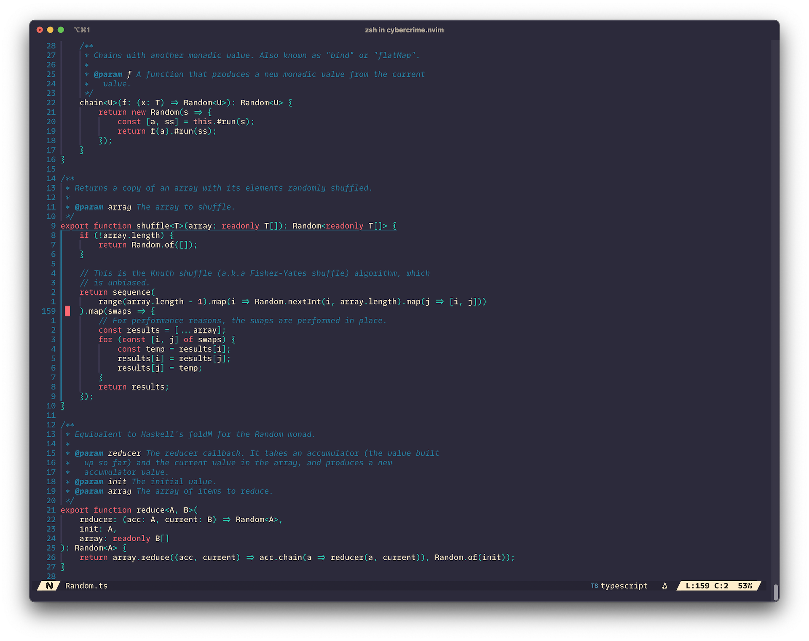

A cyberpunk-themed color scheme for neovim. Works especially well with
semi-transparent, futuristic backgrounds. It was created with
[Lush](http://git.io/lush.nvim).

As with my other color schemes, it uses a reduced # of colors to emphasize only
4 broad semantic categories: identifiers, reserved syntax
(keywords/operators/punctuation), comments, and contstants/literals. I
personally find that any further distinction beyond those creates visual
overload that reduces rather than enhances code readability.

Here is the config for the Lazy.nvim package manager (should hopefully be easy
to adapt to your favorite package manager):

```
{
    "eric-parsons/cybercrime.nvim",
    dependencies = {
        "rktjmp/lush.nvim",
    },
    -- Optional, to set it on startup.
    config = function()
        vim.cmd.colorscheme "cybercrime"
    end
}
```



